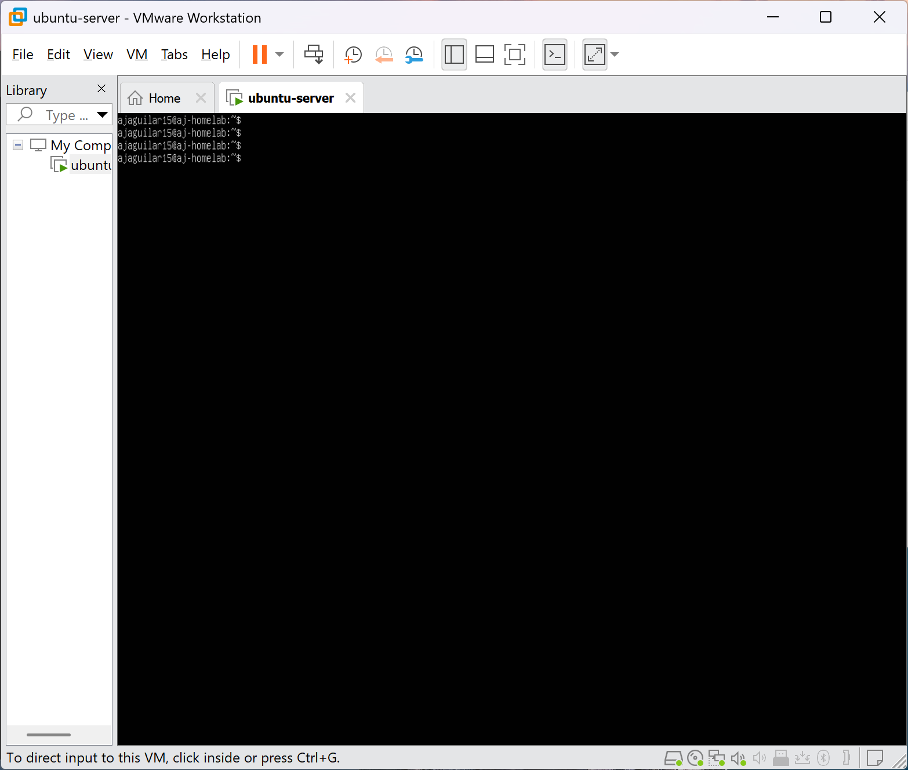
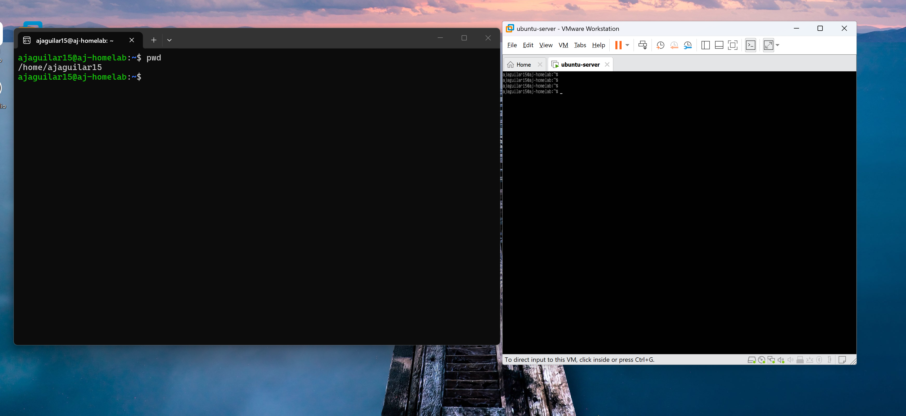

# Ubuntu Server VM Setup
<p align="center">
	
</p>

## Overview

This directory documents the initial setup process for the Ubuntu Server virtual machine running inside VMware Workstation Pro.

The Ubuntu Server VM serves as the primary Linux administration and infrastructure learning environment for this homelab project.

---

# Virtualization Architecture

```text
Physical Hardware
│
└── Windows Host Operating System
      │
      └── VMware Workstation Pro Hypervisor
            │
            └── Ubuntu Server Virtual Machine
```

---

# VMware Workstation Pro Setup

VMware Workstation Pro was installed on the Windows host machine to provide virtualization capabilities.

Key setup notes:

- VMware detected Windows Hypervisor Platform
- VMware configured itself to use the Windows virtualization backend
- VM files were stored on a secondary SSD (`D:` drive)
- NAT networking mode was selected

The VM storage location was intentionally separated from the host operating system drive for better organization and workload separation.

---

# Ubuntu Server Installation

## Installation Steps

1. Download Ubuntu Server LTS ISO
2. Create a new virtual machine in VMware
3. Select the Ubuntu Server ISO image
4. Configure:
   - CPU cores
   - RAM allocation
   - virtual disk size
5. Select NAT networking
6. Use automatic DHCP configuration
7. Install OpenSSH Server
8. Complete Ubuntu installation

---

# Networking Configuration

The VM automatically received an IP address using DHCP through VMware’s NAT networking layer.

Example interface:

```bash
ens33 192.168.x.x/24
```

Networking concepts practiced:

- DHCP
- NAT
- IPv4 addressing
- Network interfaces
- Internet connectivity testing

---

# SSH Remote Access

OpenSSH Server was installed during Ubuntu setup to allow remote administration.

## Connect to the Server

<p align="center">
	
</p>

```bash
ssh username@ipaddress
```

Example:

```bash
ssh anthony@192.168.75.128
```

This allows remote management from:

- WSL
- Linux terminals
- SSH clients

---

# Administrative Commands

## View Network Interfaces

```bash
ip a
```

---

## View Assigned IP Address

```bash
hostname -I
```

---

## Test Internet Connectivity

```bash
ping google.com
```

---

## Update Package Lists

```bash
sudo apt update
```

---

## Upgrade Installed Packages

```bash
sudo apt upgrade
```

---

## Verify SSH Status

```bash
systemctl status ssh
```

---

# Storage Configuration

Ubuntu requested confirmation for destructive storage operations during installation.

Important:

- Only the VM’s virtual disk was formatted
- The physical Windows drives were not modified

This demonstrates how virtualization isolates guest operating systems from the host system.

---

# Remote Management Workflow

```text
Windows Host
│
├── WSL Terminal
│     └── SSH Connection
│            └── Ubuntu Server VM
│
└── VMware Workstation Pro
```

The Ubuntu server can now be remotely managed without directly interacting with the VMware console.

---

# Skills Practiced

This setup introduced foundational infrastructure concepts including:

- Hypervisors
- Virtual machines
- Linux administration
- SSH remote management
- NAT networking
- DHCP networking
- Package management
- Remote system administration

---
